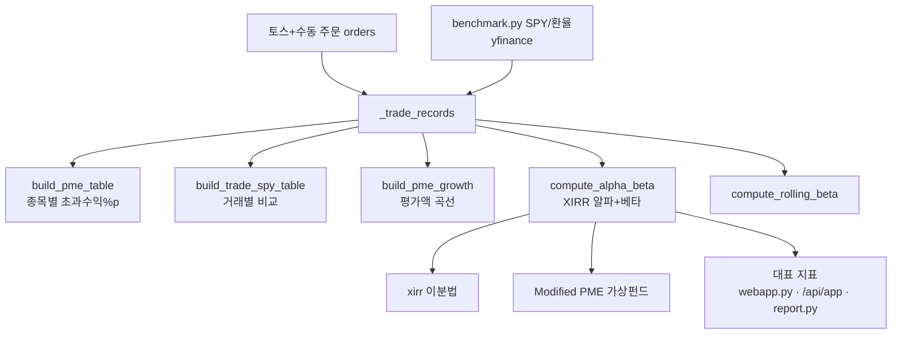

# PortfolioAI — 벤치마크(S&P500) 성과 측정 로직

이 문서는 벤치마크(S&P500) 대비 성과를 측정하는 모든 로직·수식·코드 적용 위치를 정리한 것이다.
대표 지표는 `pme.py`의 `compute_alpha_beta`가 산출하는 **XIRR 알파(%p)와 베타**이며, 대시보드 API(`/api/app/dashboard`, `webapp.py`)가 이를 사용한다.

## 0. 벤치마크의 기준: SPY

모든 비교의 기준은 `benchmark.py`에서 정의된다.

```python
BENCHMARK_TICKER = "SPY"  # S&P 500 추종 ETF
```

가격 데이터는 토스 캔들 API가 아니라 **yfinance**로 가져온다(과거 데이터 200일 제한 회피). 환율은 `KRW=X`(USD/KRW)를 쓴다. 15분 TTL 캐시(`_memo`)로 반복 호출을 줄인다.

측정 방식은 **5가지 계층**으로 나뉜다.

## 1. 단순 정규화 비교 (가격 추이만) — 타이밍 미반영

`benchmark.py`의 `normalize_to_100` + `build_growth_frame`. 첫 유효값을 100으로 리베이스해 스케일·통화 차이를 지우고 같은 출발선에서 곡선을 겹친다.

$$\text{정규화지수}_t = \frac{P_t}{P_0} \times 100$$

매매 타이밍/금액을 반영하지 않고 "주가가 SPY보다 더 올랐나?"만 본다.

### 1-1. 분기별 초과수익률 — `quarterly_excess_returns`

$$\text{분기수익률} = \left(\frac{Q_{\text{말}}}{Q_{\text{전말}}} - 1\right)\times 100, \quad \text{초과} = r_{\text{종목}} - r_{\text{SPY}}$$

SPY의 분기 수익률을 각 종목에서 빼서 **%p 단위 초과수익**을 낸다.

## 2. PME (Public Market Equivalent) — 매매 타이밍/금액 반영

이 프로젝트의 **핵심 차별점**(`pme.py`). "내가 실제로 매수/매도한 시점과 금액을 그대로 SPY에 투자했다면?"을 가정해 진짜 알파를 계산한다.

### 2-1. 거래 레코드 변환 — `_trade_records`
체결 주문에서 `(symbol, currency, side, qty, amount, date)`를 추출. 금액은 평가액 오염을 막으려 **당시 체결단가 기준**(`qty × avg_px`)으로 재계산한다.

### 2-2. 종목별 PME 초과수익표 — `build_pme_table`
각 매매 시점에 같은 금액을 SPY에 넣었다고 가정하고 가상 SPY 지분을 누적한다. 통화별 SPY 지분:

- USD 종목: `spy_delta = sign × (amount / spy_px)` — USD/USD라 환율 상쇄
- KRW 종목: `spy_delta = sign × (amount / (spy_px × fx_d))` — 원화를 원화표시 SPY가로 나눔

$$\text{내 손익} = \text{현재평가액} + \text{매도금} - \text{매수금}$$
$$\text{SPY 손익} = (\text{SPY지분} \times \text{현재SPY가}) + \text{매도금} - \text{매수금}$$
$$\text{초과수익(\%p)} = \text{내 수익률} - \text{SPY 수익률}$$

`_safe_asof`는 `asof`로 해당 날짜 이전 가장 가까운 값을 찾고, 범위 밖이면 첫 값으로 대체한다.

### 2-3. 거래별 투명 비교표 — `build_trade_spy_table`
매수 한 건씩 "당시 SPY가 → 현재 SPY가" 기간 SPY 수익률과 내 종목 수익률을 한 줄로 나란히 보여준다. KRW 종목은 SPY를 **원화 환산**해 공정 비교.

### 2-4. 시계열 성장 비교 — `build_pme_growth`
내 포트폴리오 평가액 곡선 vs SPY PME 평가액 곡선을 일별로 그린다. 둘 다 동일 현금흐름으로 구동. 원금 계단효과 제거용 수익률(%):

$$\text{수익률}_t = \left(\frac{\text{평가액}_t}{\text{누적투자원금}_t} - 1\right)\times 100$$

## 3. Modified PME + XIRR 기반 알파/베타 — 대표 지표

`pme.py`의 `compute_alpha_beta`가 대시보드 상단의 "알파/베타" 대표 지표다.

### 3-1. XIRR (연환산 내부수익률)
불규칙 현금흐름의 NPV를 0으로 만드는 할인율을 **이분법(bisection)** 200회 반복으로 찾는다.

$$\text{NPV}(r) = \sum_i \frac{CF_i}{(1+r)^{(d_i - d_0)/365}} = 0$$

부호 변화가 없으면(항상 손실/이익) 해가 없어 `None` 반환.

### 3-2. Modified PME 가상펀드
매수 시 SPY 매입, **매도 시엔 판 비중(w)만큼만 SPY도 매도**해 음수 지분(유령자본)을 방지한다.

$$w = \frac{\text{판 종목 평가액}}{\text{전체 포트폴리오 평가액}}, \quad \text{SPY지분} \mathrel{*}= (1 - w)$$

### 3-3. 알파
내 현금흐름 XIRR과 SPY 가상펀드 현금흐름 XIRR의 차이:

$$\alpha = (\text{XIRR}_{\text{포트}} - \text{XIRR}_{\text{SPY}})\times 100 \ [\%p]$$

현금흐름은 매수=유출(−), 매도=유입(+), 마지막에 현재 평가액을 유입으로 붙인다.

### 3-4. 베타 & 상관계수
기여금(매수·매도 현금흐름)을 제거한 **순수 일간 수익률**을 시장(SPY 원화환산) 대비 회귀한다.

$$r_{p,t} = \frac{V_t - V_{t-1} - \text{기여금}_t}{V_{t-1}}, \quad \beta = \frac{\text{Cov}(r_p, r_m)}{\text{Var}(r_m)}$$

주말·휴장 잡음 제거를 위해 `rm != 0`인 실거래일만 회귀에 쓴다. 반환 dict: `port_xirr_pct`, `spy_xirr_pct`, `alpha_pct`, `beta`, `corr`, `my_final_krw`, `spy_final_krw`, `invested_krw`, `n_days`.

### 3-5. 롤링 베타 — `compute_rolling_beta`
위 베타를 60일 롤링 창으로 시계열화(`cov/var`의 rolling).

## 4. 자산가치/TWR 비교 (보조 시각화)

- `build_asset_value_growth`: 내 자산가치(주식평가+배당) vs SPY Modified PME 자산가치 곡선.
- `build_twr_comparison`: **시간가중수익률(TWR)** — 추가 투입(월급 등)과 무관한 "1원당 성과". 둘 다 0%에서 출발.
- `build_total_profit_growth` / `build_ticker_profit_growth`: 수익금(평가액−원금) 곡선 비교.

## 5. 성과 자체 분해 (벤치마크 무관, 보조)

`performance.py`의 `compute_performance_summary`는 벤치마크 비교가 아니라 **내 손익을 분해**한다(평균매수단가 회계):

$$\text{총손익(원)} = \text{순수 주가손익} + \text{환차손익} + \text{배당}$$

환차손익은 `advanced_analytics.py`의 `compute_fx_pnl`에서 USD 매수원금에 `(현재환율 − 평균매수환율)`을 곱해 계산한다.

## 6. 알려진 기술 부채

`analytics_engine.py`의 `transform_to_mvp_json`에 **더미 PME**가 남아 있다:

```python
"pme_alpha_pct": round(simple_return - 10.5, 2)  # 임시 상수 기반 더미
```

실제 SPY 데이터가 아니라 "10.5%" 상수를 빼는 MVP용 값이다. 대표 지표는 `compute_alpha_beta`를 쓰지만, 이 함수 값이 어딘가 노출되면 잘못된 값을 보일 수 있어 **정리 대상**이다.

## 사용 흐름 요약



**정리**: 벤치마크 성과를 (1) 단순 정규화 곡선, (2) 매매 타이밍 반영 PME, (3) XIRR 기반 알파 + 회귀 베타의 세 축으로 측정하며, 대표 지표는 `compute_alpha_beta`의 **XIRR 알파(%p)와 베타**다.
